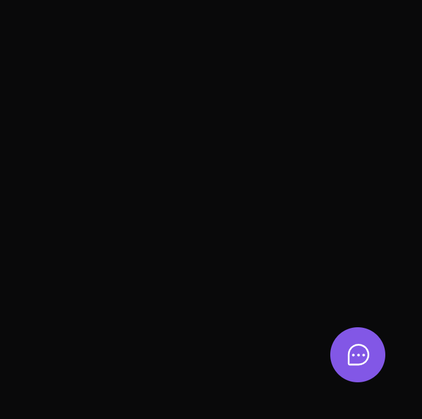
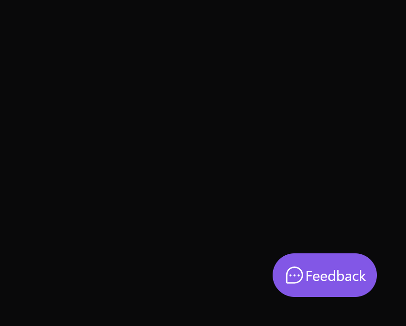
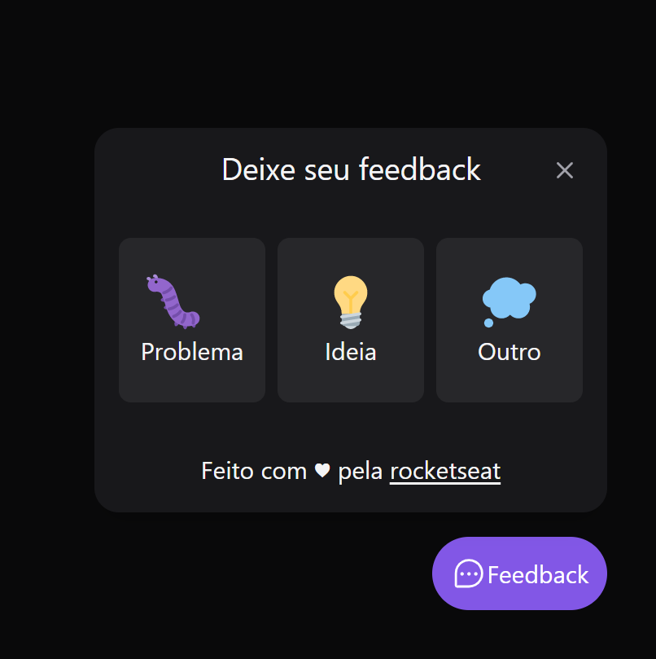
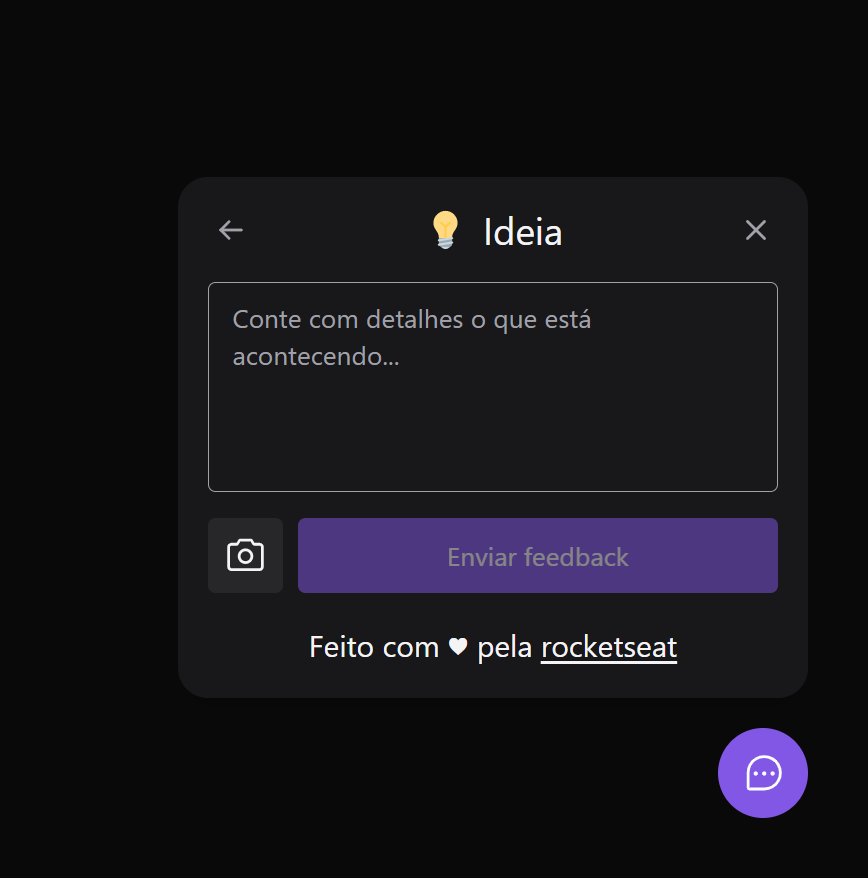

# :pencil: FeedWidget

  Este projeto foi criando para fazer feedbacks de sites ou aplicativos, a aplicação conta com uma interface bem simples e fácil de se usar, um formulário com alguns campos para serem preenchidos, onde o usupario escolhe o tipo de feedback, podendo também mandar um screenshot (imagem da tela), assim detalhando ainda mais o feedback.

### :point_right: Este respositório contém 

   - uma pasta <strong>web</strong> (Front-End da Aplicação)

### :dart: Layout da Aplicação

Imagens do Layout da Aplicação:

<div style="display: flex">
  
  
  
  
</div>


### :gear: Pré-requisitos

Antes de começar, você vai precisar ter instalado em sua máquina as sequintes ferramentas:
[Git](https://git-scm.com), [Node.js](https://nodejs.org/en/).


### :label: Rodando o Front End (projeto web)

```bash 
   # Clone este respositório
   $ git clone <https://github.com/TiagoM13/feedwidget.git>  
   # Acesse a pasta do projeto no terminal
   $ cd 

   # Vá para a pasta Server
   $ cd web

   # Instale as dependências
   $ npm install

   # Execute a aplicação em modo de desenvolvimento
   $ npm run dev

   # O servidor inciará na porta:300o - acesse <http://localhost:300>
```

## :wrench: Ferramentas

  As seguintes ferramentas foram usadas na construção do projeto:

  - Vite
  - React
  - Typescript
  - Axios
  - Tailwind
  - Oostcss
  - Phosphor

### :boy: Autor 

Tiago Mota

[LinkedIn](https://www.linkedin.com/in/tiago-mota-4690591a8/)
[Gmail](thyagomotha2000@gmail.com)